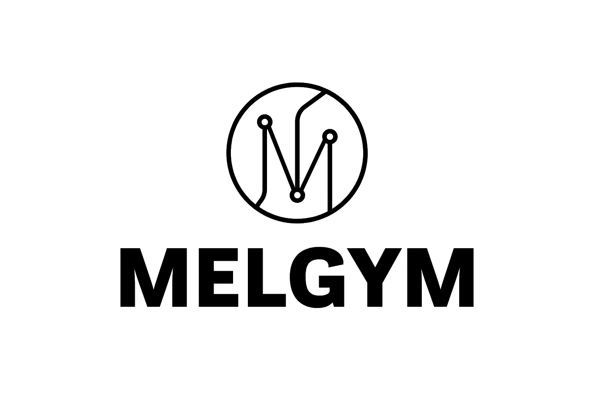
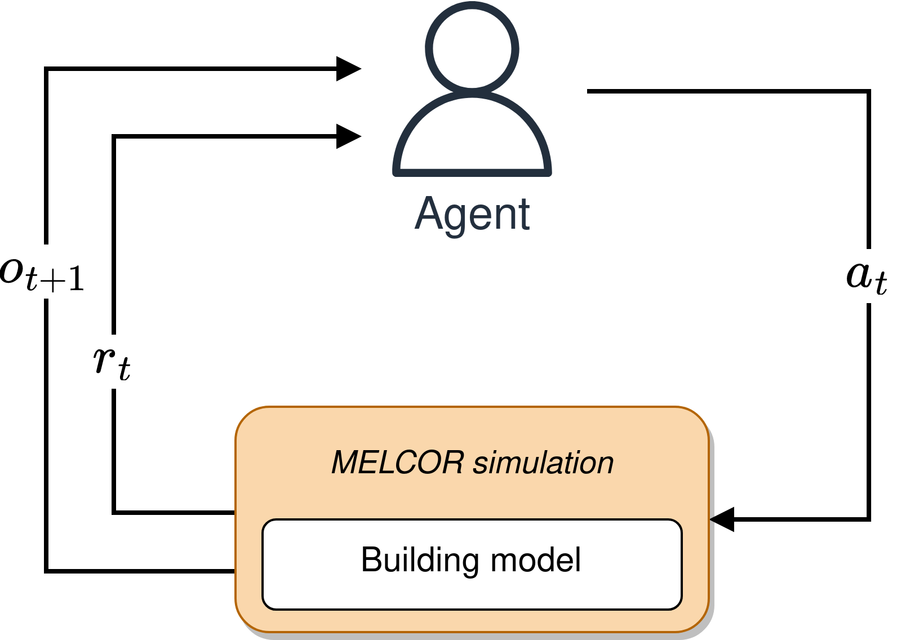

<p align="center">
    
</p>

[]()

[]() 
[](https://melgym.readthedocs.io/en/latest/?badge=latest)


**MELGYM** is a [Gymnasium](https://github.com/Farama-Foundation/Gymnasium)-based tool designed to facilitate interactive control over [MELCOR](https://melcor.sandia.gov/) 1.8.6 simulations.

Every control functionality in MELCOR is determined by Control Functions (CFs). However, the batch execution mode of MELCOR makes it difficult to interactively control and modify functions under certain user-defined conditions. Control conditions are defined a priori and sometimes requires the concatenation of several CFs that must be done in an unfriendly way.

MELGYM allows the definition of external user-defined controllers, allowing the use of reinforcement learning agents or any other custom/external control algorithm.

<p align="center">
    
</p>

## ⚙️ How it works?

MELGYM leverages MELCOR's restart capabilities to modify CFs every few simulation cycles. Just before a *warm start* is performed, the underlying MELCOR model is modified according to the last registered simulation state, and continues running until the next control action is performed.

<p align="center">
    
</p>

> Check the [MELGYM documentation](https://melgym.readthedocs.io/) for more detailed information.

## 🖥️ Setting up experiments

MELGYM environments adhere to the Gymnasium interface, and can be combined with DRL libraries such as [Stable-Baselines3](https://stable-baselines3.readthedocs.io/en/master/).

```python
import melgym
import gymnasium as gym
from stable_baselines3 import PPO

env = gym.make('presscontrol', render_mode='pressures')

# Training
agent = PPO('MlpPolicy', env)
agent.learn(total_timesteps=10_000)

# Evaluation
obs, info = env.reset()
done = trunc = False

while not (done or trunc):
    env.render()
    act, _ = agent.predict(obs)
    obs, rew, trunc, done, info = env.step(act)      

env.close()
```

For faster experimentation, the [run_experiment.py](./run_experiment.py) script allows to launch experiments by using the configuration defined in [config.yaml](./config.yaml).

```
$ ./run_experiment.py -conf config.yaml
```

## 🚀 Contributing

See our [contributing](./CONTRIBUTING.md) guidelines.

## 🧰 Side projects

MELGYM rely on the auxiliar toolbox [MELKIT](https://github.com/manjavacas/melkit/). Feel free to help us improving both projects!

