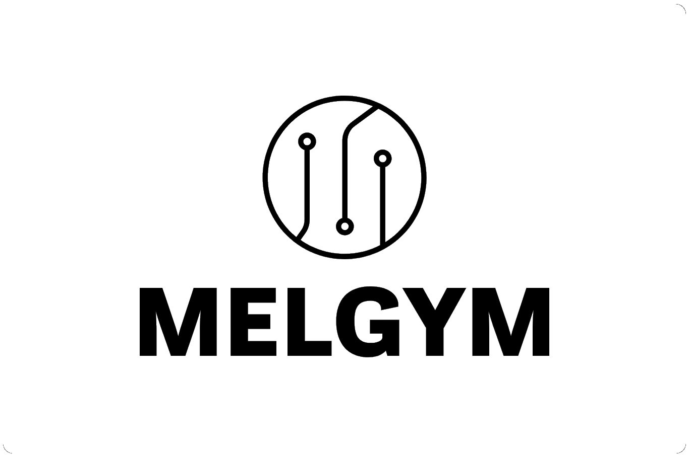
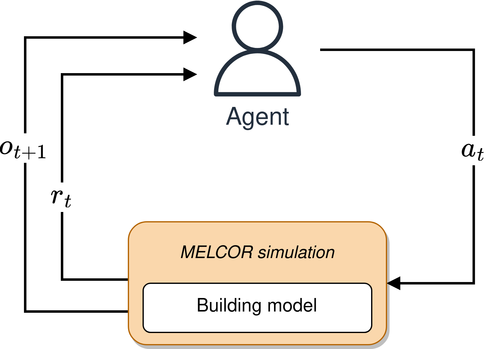
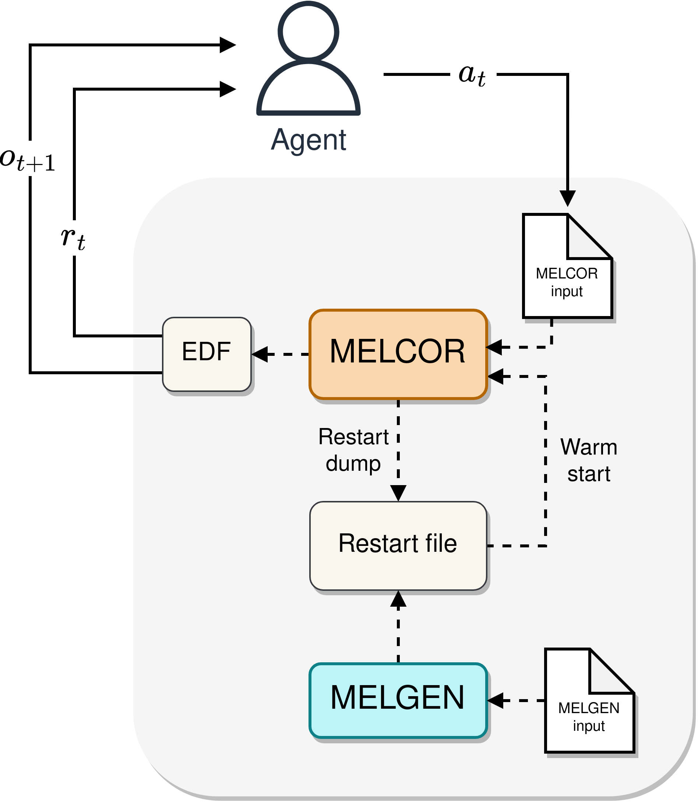
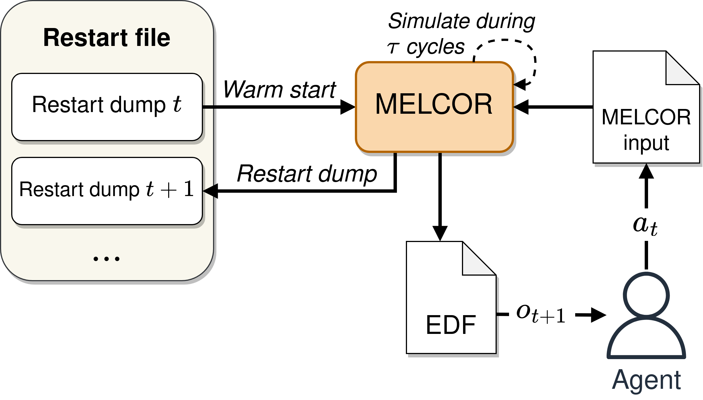
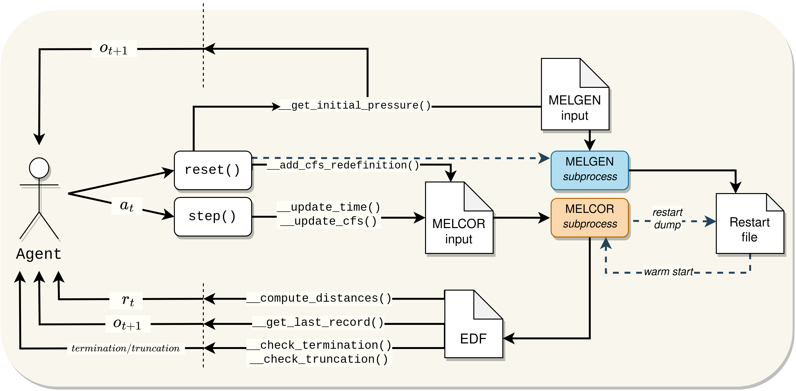

    

A [Gymnasium](https://github.com/Farama-Foundation/Gymnasium)-based interface for continuous control using [MELCOR](https://melcor.sandia.gov/) v1.8.6 and [MELKIT](https://github.com/manjavacas/melkit/). Designed to enable reinforcement learning control in MELCOR simulations.

## ⚙️ How it works?

MELGYM is oriented to modify MELCOR **control functions (CFs)** between restart dumps. This allows pseudo-continuous control using the agent-agent interaction environment described below:

    

In the current implementation fo MELGYM, the goal is to maintain stable pressures in a series of control volumes by modifying the flow rate of a given flow path. However, this framework can be adapted to perform additional control functions (e.g. temperature control, gas concentrations, etc.).

The process followed during a MELGYM run consists of the following steps:

* When the environment is created/restarted, MELGYM executes **MELGEN** and returns as **observation** the initial state of the simulation (in this case, the pressures of the controlled CVs).
* For each agent-environment interaction, MELGYM updates the current MELCOR model based on the received **action** and runs a simulation for T cycles.
* At the end of the simulation, the last records of the generated **EDF** are read, representing the latest pressure values of the CVs. These values allow the calculation of the distances to the target pressures, the sum of which is sent to the agent as a **reward** signal.

    

MELGYM leverages MELCOR's restart capabilities to modify CFs every few simulation cycles. Therefore, each time a **warm start** is performed, the model starts from the last registered state and continues simulating under the new configuration defined by the agent.

    

The following image shows a summary of the implemented functions and the low-level **agent-environment interaction**:

    

## 🖥️ Setting up experiments

The script [run_experiment.py](./run_experiment.py) allows to launch experiments using the configuration defined in [cfg.json](./cfg.json). This file defines the RL algorithm to be used, the environment, and includes additional configuration (wrappers, paths, callbacks, etc.).

